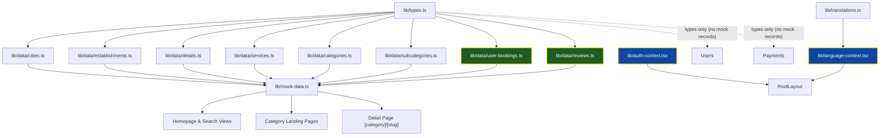
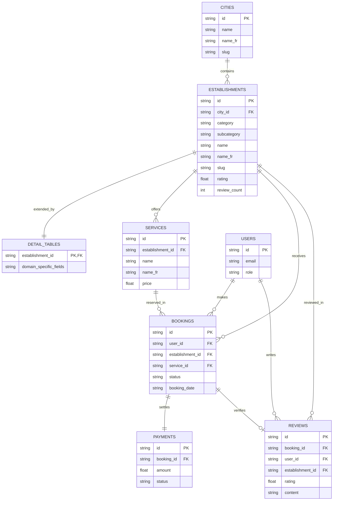

# Reserva — Data Architecture Report

## Summary

Reserva uses a **15-table relational data model** with full bilingual (EN/FR) support, a hierarchical **category → subcategory** system for search filtering, backward-compatible listing helpers, and dynamic detail pages for all 8 categories.

---

## Architecture Overview

---

## 8 Categories

| # | Key | EN Label | FR Label | Route |
|---|-----|----------|----------|-------|
| 1 | `wellness` | Wellness & Fitness | Bien-être & Fitness | `/wellness` |
| 2 | `day-passes` | Day pass | Pass journée | `/day-passes` |
| 3 | `conciergerie` | Concierge | Conciergerie | `/conciergerie` |
| 4 | `spectacles` | Tickets & Spectacles | Billetterie & Spectacles | `/spectacles` |
| 5 | `voyage` | Travel | Voyage | `/voyage` |
| 6 | `corporate` | Corporate | Entreprises | `/corporate` |
| 7 | `services` | Services | Services | `/services` |
| 8 | `restaurants` | Restaurants | Restaurants | `/restaurants` |

Each category has **subcategories** used as search filters (see Table below).

---

## Subcategories (Search Filters)

Each subcategory belongs to one parent category via `category_key` FK. When a user selects a category in the search page, the matching subcategories appear as a secondary filter dropdown.

| Category | Subcategories |
|----------|--------------|
| **Wellness** | Hair Salons & Barbers, Manicure & Pedicure, Hammam & Wellness Rituals, Aesthetic Clinics & Skincare, Home Massage, Personal Coaches, Gym, Nutritionist Consultations, Golf Course Booking, Tennis / Padel Courts |
| **Day pass** | Beach Clubs, Pool Day Pass, Kids Club & Family Activities, Private Villa Experiences, Yacht / Boat Rental, Bike / Moto / Quad Rental, Desert Camps & Excursions, Guided City Tours |
| **Concierge** | Airport Fast-Track, Luxury Chauffeur, Private Jets / Helicopters, Bodyguard, VIP Nightlife Tables, Chat Concierge, Personal Shopper, Last-Minute Bookings |
| **Spectacles** | Cinema Tickets, Theatre & Comedy Shows, Festival Passes, Museums & Exhibitions, Escape Games, Gaming Lounges |
| **Travel** | Flights, Train Tickets, Car Rental, Travel Insurance, Weekend & Custom Stays |
| **Corporate** | Team Lunch Booking, Corporate Wellness Packs, Meeting Room Booking, Corporate Events, Employee Benefits Marketplace |
| **Services** | Cleaning, Pressing Pickup & Delivery, Private Chef, Babysitting, Pet Grooming & Sitting, Chef's Table, Exclusive Tasting Menus, Private Events, Art Workshops, Sunset Rooftop Experiences |
| **Restaurants** | Brunch & Cafés, Buffets & All-You-Can-Eat, Fine Dining, Rooftops & Lounges, Chef's Table & Private Dining, Tea Time & Pastries, Family Restaurants, Romantic Restaurants, Live Music Restaurants, Karaoke Rooms, Tasting Menus, Event Dinners, VIP Tables, Exclusive Offers & Experiences |

---

## Files

### Data Layer

| File | Purpose | Records |
|------|---------|---------|
| [types.ts](file:///c:/Users/Dexter/Desktop/WORK/Reserva/lib/types.ts) | All type definitions (15 tables + UI helpers) | — |
| [cities.ts](file:///c:/Users/Dexter/Desktop/WORK/Reserva/lib/data/cities.ts) | Table 1: Cities | 2 (Casablanca, Marrakesh) |
| [establishments.ts](file:///c:/Users/Dexter/Desktop/WORK/Reserva/lib/data/establishments.ts) | Table 2: Core venue data (all 8 categories) | 33 |
| [details.ts](file:///c:/Users/Dexter/Desktop/WORK/Reserva/lib/data/details.ts) | Tables 3–10: Category-specific detail records | 33 |
| [services.ts](file:///c:/Users/Dexter/Desktop/WORK/Reserva/lib/data/services.ts) | Table 11: Bookable units (rooms, tables, treatments) | 42+ |
| [cuisines.ts](file:///c:/Users/Dexter/Desktop/WORK/Reserva/lib/data/cuisines.ts) | Translation Map: Localized cuisine labels | 11 |
| [user-bookings.ts](file:///c:/Users/Dexter/Desktop/WORK/Reserva/lib/data/user-bookings.ts) | Table 13: Hydrated user bookings with detail views | 3 |
| [reviews.ts](file:///c:/Users/Dexter/Desktop/WORK/Reserva/lib/data/reviews.ts) | Table 15: Programmatic and custom reviews | 99+ |
| [categories.ts](file:///c:/Users/Dexter/Desktop/WORK/Reserva/lib/data/categories.ts) | UI: Category card metadata | 8 |
| [subcategories.ts](file:///c:/Users/Dexter/Desktop/WORK/Reserva/lib/data/subcategories.ts) | Subcategory filter options (linked to categories) | 80+ |

### Consumer & Logic Files

| File | Changes / Role |
|------|---------|
| [mock-data.ts](file:///c:/Users/Dexter/Desktop/WORK/Reserva/lib/mock-data.ts) | Re-export hub + `toListing()` + query helpers (including subcategory filter) |
| [category-utils.ts](file:///c:/Users/Dexter/Desktop/WORK/Reserva/lib/category-utils.ts) | Category label resolution, validation, and URL helpers |
| [auth-context.tsx](file:///c:/Users/Dexter/Desktop/WORK/Reserva/lib/auth-context.tsx) | Authentication provider, session state, and login/logout handlers |
| [language-context.tsx](file:///c:/Users/Dexter/Desktop/WORK/Reserva/lib/language-context.tsx) | Translation provider and client-safe hydration logic |
| [translations.ts](file:///c:/Users/Dexter/Desktop/WORK/Reserva/lib/translations.ts) | Bilingual (EN/FR) dictionary for all application screens |
| [app/s/page.tsx](file:///c:/Users/Dexter/Desktop/WORK/Reserva/app/s/page.tsx) | Search page with category + subcategory dropdown filters |

### Category Landing Pages

| Route | File |
|-------|------|
| `/wellness` | `app/wellness/page.tsx` |
| `/day-passes` | `app/day-passes/page.tsx` |
| `/conciergerie` | `app/conciergerie/page.tsx` |
| `/spectacles` | `app/spectacles/page.tsx` |
| `/voyage` | `app/voyage/page.tsx` |
| `/corporate` | `app/corporate/page.tsx` |
| `/services` | `app/services/page.tsx` |
| `/restaurants` | `app/restaurants/page.tsx` |
| `/:category/:slug` | `app/[category]/[slug]/page.tsx` (dynamic detail page) |

---

## Complete Data Model (15 Tables)

### Relational Schema (Star Schema Diagram)

---

### Active Tables (with mock data)

#### Table 1: Cities
Core location reference.
- **Fields:** `id`, `name`, `name_fr`, `slug`, `region`, `region_fr`, `image`, `coordinates`, `description`, `description_fr`, `listings_count`.
- **Records:** 2 (Casablanca, Marrakesh).

#### Table 2: Establishments
Shared venue core for all 8 categories.
- **Fields:** `id`, `owner_id`, `name`, `name_fr`, `slug`, `category` (FK → categories), `subcategory` (FK → subcategories), `short_description`, `short_description_fr`, `full_description`, `full_description_fr`, `city_id` (FK → cities), `address`, `coordinates`, `phone`, `email`, `website`, `cover_image`, `gallery_images`, `rating`, `review_count`, `price_level` (`$`, `$$`, `$$$`, `$$$$`), `tags`, `is_featured`, `status`, `sort_order`, `created_at`, `updated_at`.
- **Records:** 33 venues.

#### Table 3: Voyage Details (Hotels / Stays)
- **Fields:** `establishment_id` (FK → Establishments), `star_rating` (1–5), `property_type` (`hotel`, `riad`, `villa`, `apartment`, `resort`, `guesthouse`), `check_in_time`, `check_out_time`, `total_rooms`, `amenities` (string array), `house_rules` (smoking, pets, parties), `languages_spoken` (string array), `cancellation_policy`.
- **Records:** 5 (h1–h5).

#### Table 4: Restaurant Details
- **Fields:** `establishment_id` (FK → Establishments), `cuisine_type` (string array), `opening_hours` (days of the week), `dress_code` (`casual`, `smart_casual`, `formal`), `seating_options` (string array), `total_seats`, `average_meal_duration` (minutes), `accepts_walkins` (boolean), `alcohol_served` (boolean), `dietary_options` (string array), `menu_url`, `cancellation_policy`.
- **Records:** 7 (r1–r7).

#### Table 5: Wellness Details (Wellness / Spa)
- **Fields:** `establishment_id` (FK → Establishments), `spa_type` (`hammam`, `day_spa`, `wellness_center`, `resort_spa`), `facilities` (string array), `opening_hours` (days of the week), `therapist_gender_available` (string array), `couple_treatments` (boolean), `products_used` (string array), `general_contraindications` (optional string), `preparation_time_minutes`, `cancellation_policy`.
- **Records:** 5 (s1–s5).

#### Table 6: Day Pass Details
- **Fields:** `establishment_id` (FK → Establishments), `facilities_included` (string array), `opening_hours` (days of the week), `kids_allowed` (boolean), `towels_provided` (boolean), `cancellation_policy`.
- **Records:** 5 (dp1–dp5).

#### Table 7: Spectacles Details (Entertainment)
- **Fields:** `establishment_id` (FK → Establishments), `event_type` (string), `date` (string), `start_time`, `end_time`, `age_restriction` (optional string), `cancellation_policy`.
- **Records:** 5 (ev1–ev5).

#### Table 8: Conciergerie Details (VIP & Concierge)
- **Fields:** `establishment_id` (FK → Establishments), `highlights`, `highlights_fr`, `booking_mode` (`appointment`, `reservation`, `ticket`, `request`), `opening_hours`, `availability_note`, `availability_note_fr`, `cancellation_policy`.
- **Records:** 2 (vip1, vip2).

#### Table 9: Corporate Details (B2B)
- **Fields:** `establishment_id` (FK → Establishments), `highlights`, `highlights_fr`, `booking_mode`, `min_group_size`, `max_group_size`, `opening_hours`, `availability_note`, `availability_note_fr`, `cancellation_policy`.
- **Records:** 2 (corp1, corp2).

#### Table 10: Services Details (Home & Lifestyle)
- **Fields:** `establishment_id` (FK → Establishments), `highlights`, `highlights_fr`, `booking_mode`, `service_area` (string array), `opening_hours`, `availability_note`, `availability_note_fr`, `cancellation_policy`.
- **Records:** 2 (svc1, svc2).

#### Table 11: Services (Bookable Units)
The actual bookable item (e.g., room types, table slots, treatments).
- **Fields:** `id`, `establishment_id` (FK → Establishments), `name`, `name_fr`, `slug`, `short_description`, `short_description_fr`, `full_description`, `full_description_fr`, `service_type`, `price`, `currency` (MAD), `requires_deposit` (boolean), `deposit_amount`, `deposit_type` (`fixed`, `percentage`), `tax_included`, `tax_rate`, `duration_minutes`, `min_people`, `max_people`, `capacity_per_slot`, `is_available`, `available_days`, `start_time`, `end_time`, `blackout_dates`, `advance_booking_hours`, `cancellation_deadline_hours`, `requires_confirmation`, `instant_booking`, `allow_cancellation`, `cancellation_policy`, `included_items`, `excluded_items`, `add_ons` (name, name_fr, price), `cover_image`, `gallery_images`, `status` (`draft`, `active`, `inactive`, `archived`), `is_featured`, `sort_order`, `created_at`, `updated_at`.
- **Records:** 42+ active bookable units.

#### Table 13: Bookings
Used to track active reservations in the user profile.
- **Backend Schema (`Booking` in `types.ts`):** `id`, `user_id` (FK → Users), `establishment_id` (FK → Establishments), `service_id` (FK → Services), `status` (`pending`, `confirmed`, `cancelled`, `completed`, `no_show`), `booking_date`, `start_time`, `end_time`, `guest_count`, `special_requests`, `total_price`, `deposit_paid`, `confirmation_code`, `cancelled_at`, `cancellation_reason`, `created_at`, `updated_at`.
- **Frontend Active Mock Schema (`UserBooking` in `user-bookings.ts`):** Hydrated, descriptive model built to render immediate guest vouchers. Includes properties such as `listing_id`, `category`, `slug`, `service_name/service_name_fr`, `offerTitle/offerTitle_fr`, `offerImage`, `city/city_fr`, `address`, and `notes/notes_fr`.
- **Records:** 3 active user bookings (`bk-2026-001` for Le Jardin in Casablanca, `bk-2026-002` for La Mamounia in Marrakesh, and `bk-2026-003` for So Spa Sofitel in Casablanca).

#### Table 15: Reviews
Verified feedback submitted by guests.
- **Fields:** `id`, `booking_id` (FK → Bookings), `user_id` (FK → Users), `establishment_id` (FK → Establishments), `rating` (1–5), `title`, `content`, `photos` (string array), `owner_reply`, `owner_reply_at`, `is_verified` (boolean), `status` (`pending`, `published`, `hidden`, `flagged`), `created_at`, `updated_at`.
- **Implementation & Records:** Fully realized in `lib/data/reviews.ts`. Generates **99 static reviews** (3 per establishment) utilizing a pool of 16 Moroccan reviewers with unique avatars.
- **Client Dynamics:** Integrates browser `localStorage` under `reserva_custom_reviews` to persist new user reviews and dynamically increments venue review counts via `reserva_local_review_counts`.

---

### Future Tables (types defined, no database mock data yet)

#### Table 12: Users
Core user accounts and access control.
- **Fields:** `id` (UUID), `email`, `phone`, `first_name`, `last_name`, `avatar_url`, `preferred_language` (`en` | `fr`), `role` (`guest`, `owner`, `admin`), `email_verified` (boolean), `created_at`, `updated_at`.
- **Status:** Fully defined in `types.ts`. Active client session objects are managed via `auth-context.tsx` and cached in `localStorage` as standard JSON.

#### Table 14: Payments
Payment logs for deposit and full settlements.
- **Fields:** `id`, `booking_id` (FK → Bookings), `user_id` (FK → Users), `amount`, `currency` (MAD), `payment_method` (`card`, `bank_transfer`, `cash`, `wallet`), `payment_type` (`deposit`, `full`, `refund`), `status` (`pending`, `processing`, `completed`, `failed`, `refunded`), `gateway_ref` (Stripe/CMI reference), `paid_at`, `refunded_at`, `created_at`, `updated_at`.
- **Status:** Type-defined in `types.ts`, awaiting transactional database integration.

---

## Authentication & Session Management Architecture

The authentication layer is implemented in `lib/auth-context.tsx` and provides seamless, secure client-side state handling.

### Core Structure:
- **`AuthProvider`**: Wraps the application to expose authentication states (`isLoggedIn`, `user`, `isLoading`) and handlers (`login`, `logout`) via the custom hook `useAuth()`.
- **Session Persistence:** Saves session parameters in the browser's `localStorage` under the keys `"user"` and `"token"`. When a user loads the website, a `useEffect` hook parses the stored JSON, avoiding unnecessary log-ins.
- **Typing Differences & Reconciliation:** 
  - The client-side context uses a lightweight, optimized `User` interface: `{ id: string; name: string; email: string; phone?: string; avatar?: string }`.
  - The backend relational model `User` in `types.ts` uses separate names (`first_name`, `last_name`), `avatar_url`, `preferred_language`, and `role`.
  - *Strategy:* The context bridges this gap by mapping client details dynamically to relational databases during booking actions and reviews.

---

## Bilingual & Localization Strategy (EN/FR)

Reserva is built from the ground up for a multilingual audience, supporting smooth transitions between English (`en`) and French (`fr`).

### Core Elements:
1. **`LanguageProvider` (`lib/language-context.tsx`)**:
   - Manages the active translation state and handles user preferences saved in `localStorage.getItem("language")`.
   - **Hydration Mismatch Mitigation:** Next.js can trigger a React hydration error if the server-rendered HTML (which defaults to French) differs from the client-rendered HTML (e.g. if the user has English set as their preference). To solve this, `LanguageProvider` forces French (`"fr"`) during server-side rendering and initial mount. It then checks `localStorage` and safely re-renders the preferred language only after the client mount is complete.
2. **Translation Dictionary (`lib/translations.ts`)**:
   - A highly detailed, **64KB localization file** containing full text keys for both languages.
   - Encompasses navigation tabs, landing pages, listings breadcrumbs, search sorting/filters, support hours, B2B calculations, and client settings.

---

## Relational Strategy (Best Practice)

| Entity | Strategy |
|--------|----------|
| **Categories** | 8 fixed top-level categories (`EstablishmentCategory` union type) |
| **Subcategories** | Linked to parent category via `category_key` FK — used as search filters |
| **Establishments** | Central table; each row has `category` + optional `subcategory` FK |
| **Detail Tables** | 1 per category (Tables 3–10), linked via `establishment_id` FK |
| **Services** | Bookable units linked to establishments via `establishment_id` FK |
| **Bookings** | Links `user_id` + `establishment_id` + `service_id` |
| **Reviews** | Connects verified guests directly to establishments and bookings |

> [!NOTE]
> The architecture uses a **star schema** approach: `Establishments` is the central fact table, with category-specific detail tables as dimensions. This keeps the core table clean while allowing each category to have its own domain-specific fields — ideal for a multi-category booking platform.

---

## Bilingual Support (EN/FR)

All data-driven text is translatable:

| Component | Fields Translated |
|-----------|------------------|
| Categories section | Label, description |
| Subcategories (search filters) | Label, label_fr |
| Popular/trending section | Name, description, city |
| Search page (List + Grid cards) | Name, description, city |
| Category landing pages | Page title, subtitle, city name, region |
| Listing detail page | Uses translatable fields from establishments and details |

---

## Verification Checklist

| Check | Status |
|-------|--------|
| TypeScript compilation | ✅ Zero errors |
| 8 categories defined | ✅ types.ts + categories.ts |
| 80+ subcategories defined | ✅ subcategories.ts |
| Subcategory filter on search page | ✅ Desktop dropdown + mobile drawer |
| Establishments tagged with subcategory | ✅ All 33 establishments |
| Detail tables for all 8 categories | ✅ details.ts (33 records total) |
| Localized cuisine filter & tagging | ✅ cuisines.ts (11 items) + page.tsx filter + custom details tag |
| Bilingual (EN/FR) support | ✅ All data + subcategories + 64KB dictionary |
| CorporateDetails has own interface | ✅ Not aliased |
| ServicesDetails has own interface | ✅ Not aliased |
| Active reviews & bookings data layer | ✅ 99 reviews + 3 bookings |
| Session & Authentication context | ✅ Local storage syncing |
| Future types (Users, Payments) | ✅ Defined in types.ts |
